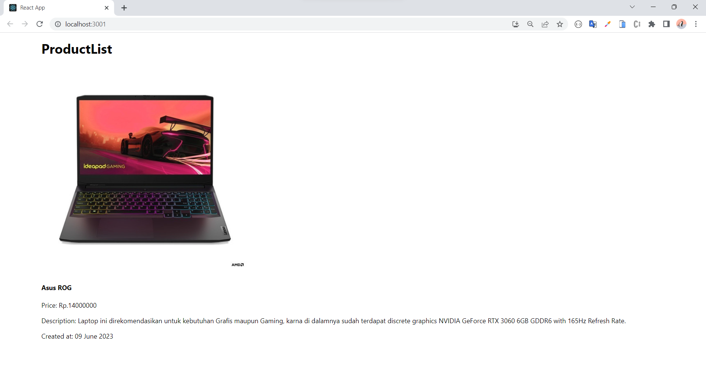
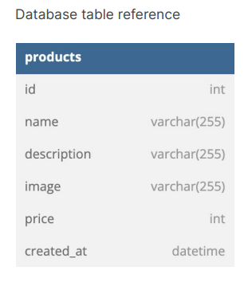

# Final Project - Backend

Eureka Xpert  
Fullstack Junior Web Development  
&copy;2023

### Common setup
- open `XAMPP` app 
- start `Apache` & `MySQL`
- open `Postman` app to do CRUD data
- open terminal in VSCode
- enter in `backend directory`, run `nodemon index.js` to running server

### Database setup - MySQL
- create database by name `store`
- create table by name `products`
- create the structure data of table with thise specification:

- add `id` attribute as AUTO INCREMENT and PRIMARY KEY

## Backend

Build using:
- NodeJS
- ExpressJS
- Nodemon (to run server automatically)

## Database
- MySQL

## Others
- VSCode
- XAMPP
- Postman
- Chrome